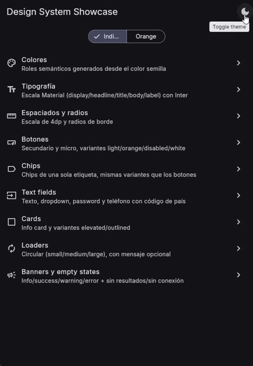
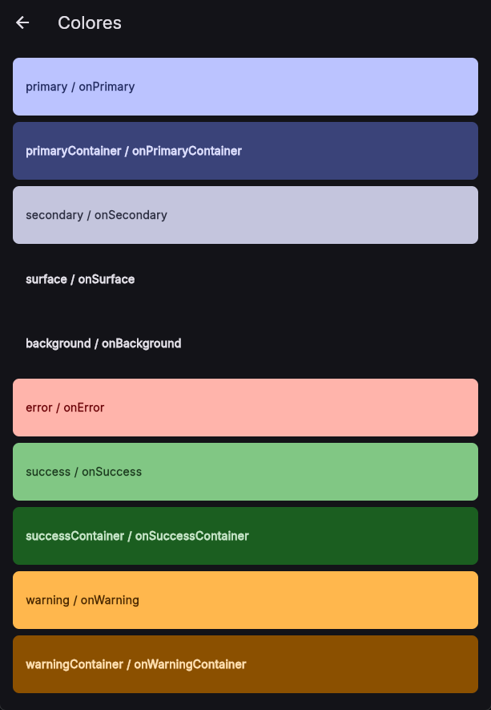
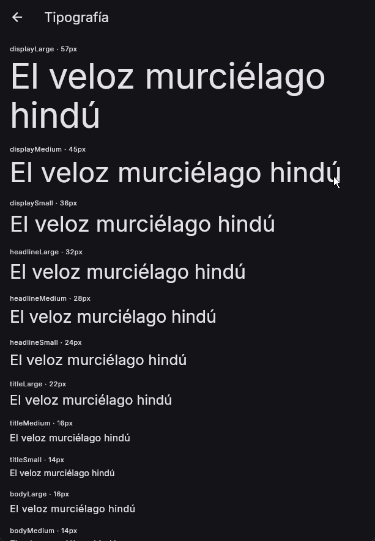
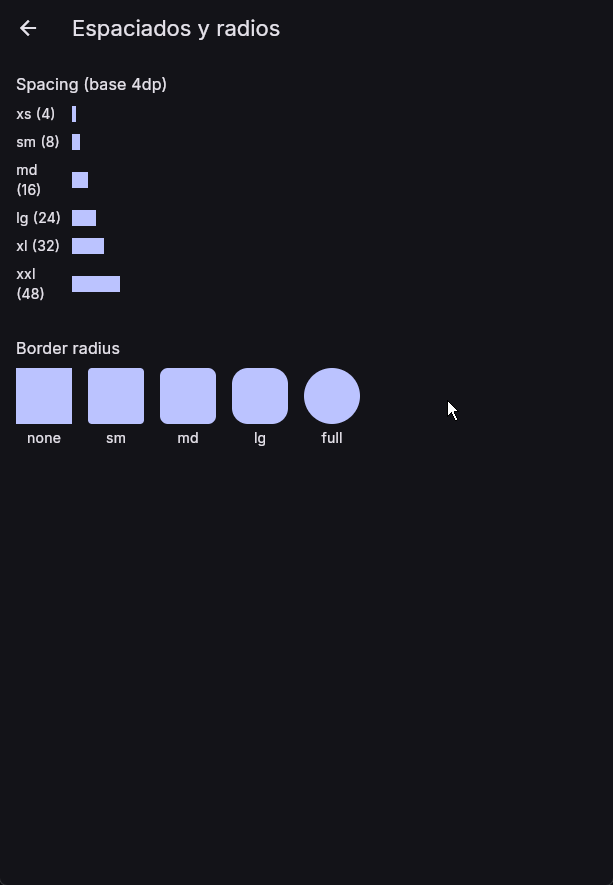
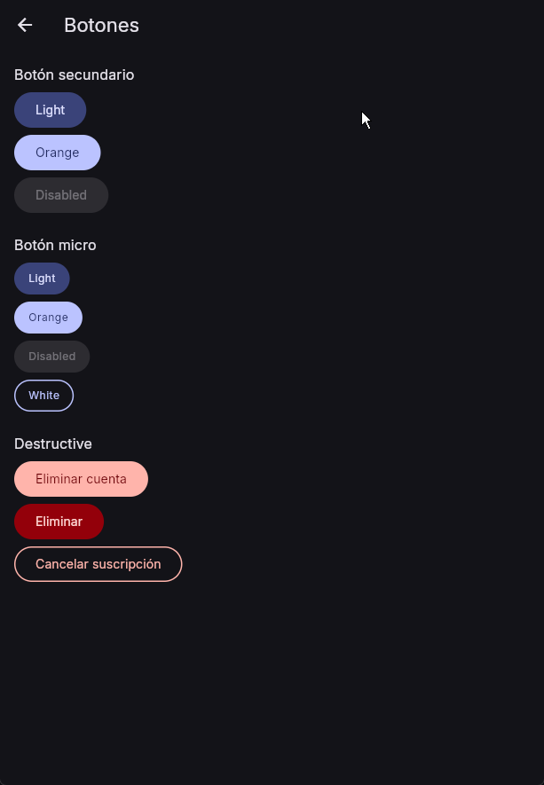
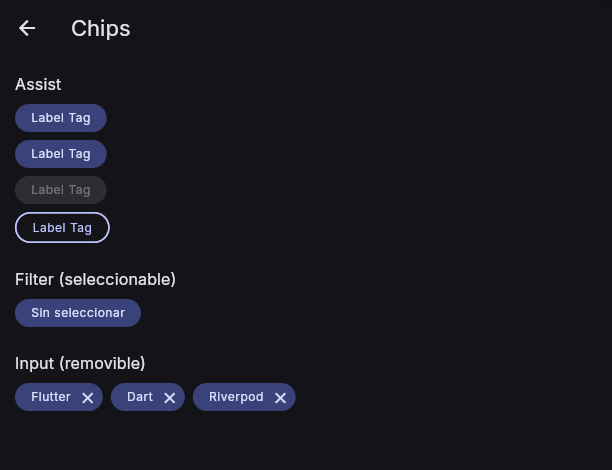
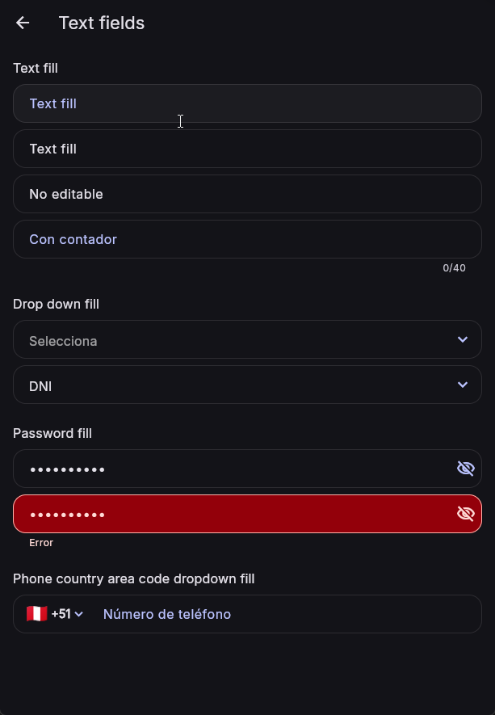
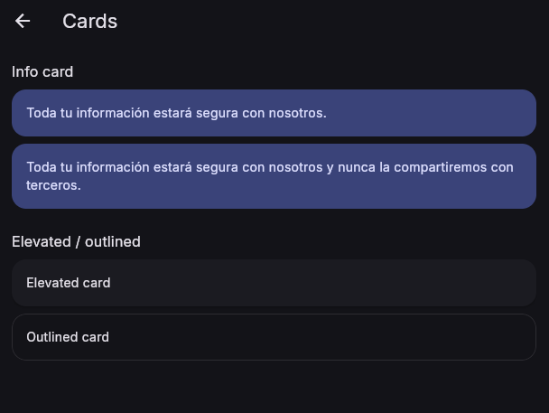
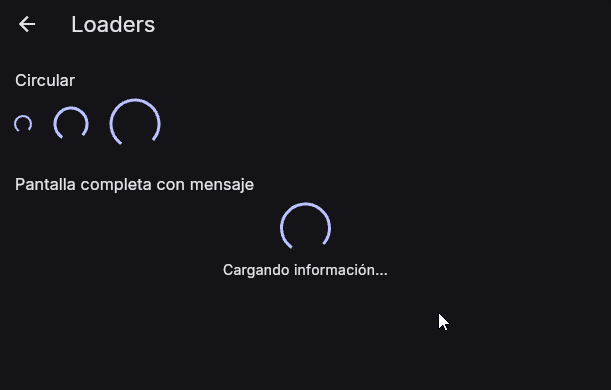
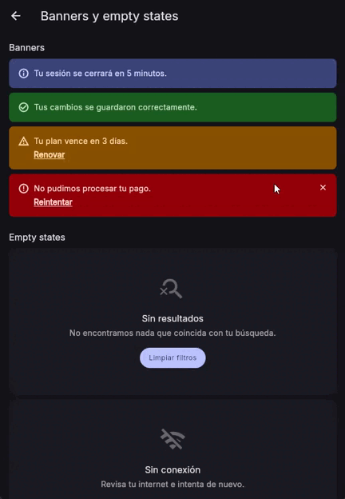

# app_ui_kit

Sistema de diseño reutilizable para Flutter: tokens visuales (color, tipografía, espaciado, radios) y componentes construidos sobre ellos, organizados con Atomic Design. Soporta dos marcas intercambiables (`AppBrand.indigo` / `AppBrand.orange`) y light/dark en ambas.

Este paquete **no se ejecuta por sí mismo**. Para ver todos los componentes y sus variantes/estados, corre la app showcase.

## Requisitos

- Dart `^3.9.2`
- Flutter `>=3.35.0`

## Calidad de código

El paquete raíz lintea con [`very_good_analysis`](https://pub.dev/packages/very_good_analysis) (más estricto que `flutter_lints`, usado en `example/`).

## Instalación

**Desde otro repo/proyecto** (por ejemplo, la app de fase 5), como dependencia git:

```yaml
dependencies:
  app_ui_kit:
    git:
      url: https://github.com/abialex/growth_flutter_fase_04_riverpood.git
      ref: v0.5.1   # usa un tag de release, no `master`, para no arrastrar
                    # cambios sin querer — ver tags disponibles en el repo
```

**Para trabajar en el paquete mismo** (este repo), como dependencia local desde `example/`:

```yaml
dependencies:
  app_ui_kit:
    path: ../
```

## Inicialización

Todo se importa desde un único barrel. Un solo `AppTheme` arma el `ThemeData` completo (colores, tipografía) para `MaterialApp`:

```dart
import 'package:app_ui_kit/app_ui_kit.dart';

MaterialApp(
  theme: AppTheme.light(brand: AppBrand.indigo),
  darkTheme: AppTheme.dark(brand: AppBrand.indigo),
  home: MyHome(),
);
```

La tipografía usa únicamente Inter, empaquetada localmente mediante `google_fonts`, sin descargas durante la ejecución.

## Uso

### Colores

Dentro de un widget, `context.colors` sigue el brillo y la marca del `AppTheme` activo:

```dart
import 'package:app_ui_kit/app_ui_kit.dart';
import 'package:flutter/material.dart';

class ThemeAwareColors extends StatelessWidget {
  const ThemeAwareColors({super.key});

  @override
  Widget build(BuildContext context) {
    final colors = context.colors;
    return ColoredBox(
      color: colors.surface,
      child: Text('Contenido', style: TextStyle(color: colors.onSurface)),
    );
  }
}
```

Sin `BuildContext`, resuelve los roles con `AppColors.resolve`. Si omites los
argumentos, usa `Brightness.light` y `AppBrand.indigo`; para una marca o modo
distinto, pasa los valores actuales de tu app:

```dart
import 'package:app_ui_kit/app_ui_kit.dart';
import 'package:flutter/material.dart';

final defaultColors = AppColors.resolve();
final defaultPrimary = AppColors.primary;
final colors = AppColors.resolve(
  brightness: Brightness.dark,
  brand: AppBrand.orange,
);
final primary = colors.primary;
final onPrimary = colors.onPrimary;
```

`AppColors.primary` también está disponible como atajo para el valor
predeterminado light/indigo. Es fijo; para que los colores sigan los cambios de
modo o marca, el consumidor debe obtener el `Brightness` y `AppBrand` actuales
de su tema o estado y pasarlos a `AppColors.resolve`. Cuando esos valores
cambien, vuelve a resolver la paleta. Usa juntos los roles relacionados —por
ejemplo, `primary` y `onPrimary`— para mantenerlos en la misma combinación de
brillo y marca.

### Tokens y enums

```dart
// Enums disponibles
AppBrand.indigo | AppBrand.orange
AppEmphasis.solid | AppEmphasis.light | AppEmphasis.outline

// Tipografía con contexto — sale del ThemeData que arma AppTheme
Theme.of(context).textTheme.titleMedium
Theme.of(context).textTheme.bodyLarge

// Tipografía sin contexto — usa los mismos tokens y roles de color
final textTheme = AppTypographyTokens.light(brand: AppBrand.indigo);
Text('Título', style: textTheme.titleMedium)

// Espaciado y radios
AppSpacing.md    // 16
AppRadius.full   // 999 (pill)

// Elevation, ancho de borde, tamaño de ícono, opacidad
AppElevation.low
AppBorderWidth.medium
AppIconSize.md
AppOpacity.disabledForeground
```

### Botones

```dart
AppButton(
  label: 'Continuar',
  onPressed: () {},
);

AppButton(
  label: 'Cancelar suscripción',
  emphasis: AppEmphasis.outline,
  isDestructive: true,
  onPressed: () {},
);

AppButton(
  label: 'Guardando...',
  isLoading: true,
  size: AppButtonSize.small,
  onPressed: () {},
);
```

### Chips / Tags

```dart
// assist — tag informativo simple
AppChip(label: 'Label Tag', emphasis: AppEmphasis.light);

// filter — seleccionable
AppChip(
  label: 'Filtrar',
  type: AppChipType.filter,
  isSelected: isSelected,
  onSelected: (value) => setState(() => isSelected = value),
);

// input — removible
AppChip(
  label: 'Flutter',
  type: AppChipType.input,
  onDeleted: () => tags.remove('Flutter'),
);
```

### Text fields

```dart
AppTextField(
  label: 'Nombre',
  hint: 'Text fill',
  errorText: hasError ? 'Campo requerido' : null,
);

AppPasswordField(
  label: 'Contraseña',
  controller: passwordController,
);

AppDropdownField<String>(
  hint: 'Selecciona',
  items: const [
    AppDropdownItem(value: 'dni', label: 'DNI'),
    AppDropdownItem(value: 'ce', label: 'Carnet de extranjería'),
  ],
  onChanged: (value) {},
);

AppPhoneField(
  countryFlag: '🇵🇪',
  countryCode: '+51',
  onCountryTap: () {},
);
```

### Validadores de formularios

`AppValidators` ofrece validadores configurables compatibles con
`FormFieldValidator<String>`. Los validadores de formato y longitud aceptan
valores vacíos para poder combinarlos con `requiredField`.

```dart
import 'package:app_ui_kit/app_ui_kit.dart';
import 'package:flutter/material.dart';

TextFormField(
  validator: AppValidators.password(
    minLength: 6,
    requireUppercase: true,
    requireSpecialCharacter: true,
  ),
);

TextFormField(
  validator: AppValidators.compose([
    AppValidators.requiredField(),
    AppValidators.email(),
  ]),
);
```

Puedes personalizar los mensajes mediante los parámetros `message` o sus
variantes específicas. `compose` ejecuta las reglas en orden y devuelve el
primer error.

### Cards

```dart
AppCard(
  variant: AppCardVariant.filled,
  child: const Text('Toda tu información estará segura con nosotros.'),
);

AppCard(
  variant: AppCardVariant.outlined,
  onTap: () {},
  header: const Text('Encabezado'),
  child: const Text('Contenido'),
);
```

### Loaders

```dart
AppLoader(size: AppLoaderSize.small);
AppLoader(size: AppLoaderSize.large, message: 'Cargando información...');
```

### Banners y empty states

```dart
AppBanner(
  variant: AppBannerVariant.warning,
  message: 'Tu plan vence en 3 días.',
  actionLabel: 'Renovar',
  onAction: () {},
);

AppEmptyState(
  icon: Icons.search_off_outlined,
  title: 'Sin resultados',
  description: 'No encontramos nada que coincida con tu búsqueda.',
  actionLabel: 'Limpiar filtros',
  onAction: () {},
);
```

## Ver el sistema en vivo (showcase)

```bash
cd example
flutter run -d chrome
```

La app showcase (`example/`) está organizada por categoría y muestra cada componente con todas sus variantes y estados.

## Vista previa del Showcase

Las siguientes capturas están versionadas dentro de `assets/showcase`, por lo
que no dependen de enlaces externos ni de archivos temporales.

### Vista general

<p align="center">
  
</p>

<table>
  <tr>
    <td align="center"><strong>Colores</strong><br></td>
    <td align="center"><strong>Tipografía</strong><br></td>
  </tr>
  <tr>
    <td align="center"><strong>Espaciado y radios</strong><br></td>
    <td align="center"><strong>Botones</strong><br></td>
  </tr>
  <tr>
    <td align="center"><strong>Chips</strong><br></td>
    <td align="center"><strong>Campos</strong><br></td>
  </tr>
  <tr>
    <td align="center"><strong>Tarjetas</strong><br></td>
    <td align="center"><strong>Loaders</strong><br></td>
  </tr>
  <tr>
    <td colspan="2" align="center"><strong>Banners y estados vacíos</strong><br></td>
  </tr>
</table>

## Arquitectura

> Detalle interno del paquete — no hace falta para usarlo, solo para contribuirle.

```
lib/
├── app_ui_kit.dart      # barrel público del paquete
└── src/
    ├── tokens/              # color (2 marcas), tipografía, espaciado, radios, elevation, iconos, opacidad
    ├── atoms/                # AppButton, AppLoader
    ├── molecules/            # AppCard, AppChip, AppTextField, AppPasswordField, AppDropdownField, AppPhoneField
    ├── validation/           # AppValidators para reglas comunes de formularios
    └── organisms/            # AppBanner, AppEmptyState
```

Cada capa expone un barrel (`tokens.dart`, `atoms.dart`, `molecules.dart`, `organisms.dart`) re-exportado desde `app_ui_kit.dart`.

### Contribuir un componente nuevo

1. Ubícalo en la capa correcta (`atoms`/`molecules`/`organisms`) según Atomic Design.
2. Usa únicamente tokens existentes — si falta uno, agrégalo primero en `src/tokens/`.
3. Expórtalo en el barrel de su capa.
4. Agrega su página en `example/` mostrando todas las variantes/estados.
5. Corre `flutter analyze` en la raíz y en `example/`.
